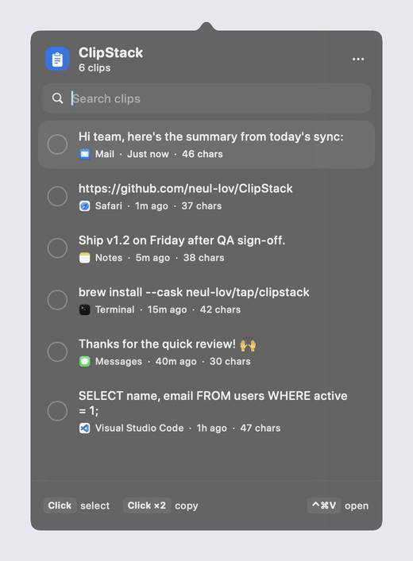

# ClipStack

A menu bar clipboard history for macOS. Every copy shows up in the list. Pick several clips, by clicking or dragging, and ClipStack copies them back as one, in the order you picked them.

<p align="center"></p>

## Install

Requires macOS 14 or later on Apple silicon.

**Homebrew**

```sh
brew install --cask neul-lov/tap/clipstack
```

**Download**

Grab `ClipStack.dmg` from the [latest release](https://github.com/neul-lov/ClipStack/releases/latest), open it, and drag ClipStack into Applications.

ClipStack isn't notarized yet, so macOS warns about an unidentified developer the first time. Right-click the app and choose **Open**, or run:

```sh
xattr -dr com.apple.quarantine /Applications/ClipStack.app
```

## Using it

- Click the clipboard icon in the menu bar to open the history.
- Click clips, or drag across them, to select them; the number on each shows its place in the order. Double-click a clip to copy just that one. Click empty space to clear the selection.
- ⏎ or **Copy N Items** copies the selection back to back with nothing in between (add line breaks, spaces or commas under the ••• menu). The footer shows the character count, spaces included.
- **After Copying** in the ••• menu decides what happens next (all but Just Copy need Accessibility access once):
  - **Paste Right Away** (default) pastes into the app you were using.
  - **Paste on Next ⏎** waits up to 10 seconds: click into any text field and press ⏎ to paste there. The menu bar icon turns into a return arrow while it waits. Typing anything else, or esc, cancels it, so a ⏎ that sends what you typed is never taken over. Password fields, non-empty fields and terminals are left alone.
  - **Just Copy** only puts the clips on the clipboard.
- The wand button next to **Copy**, or right-clicking a clip, offers **Copy As**: trim spaces, single line, UPPERCASE, lowercase, Title Case, or remove quotes.
- **Keep History** in the ••• menu removes unpinned clips after 1 day, 1 week, or 1 month.
- Hover a clip to pin it, copy only that clip, or delete it.
- Keyboard: ↑ ↓ move, ⇥ select, ⏎ copy, ⌘P pin, ⌘⌫ delete, esc clears the selection, then the search, then closes.

## Privacy

- History stays on your Mac, encrypted (AES-GCM) in `~/Library/Application Support/ClipStack/history.dat`. The key lives in your login keychain; after an update macOS may ask once whether ClipStack can use it.
- Copies that password managers mark as private are never recorded. With **Skip Passwords & Keys** on (the default), text that looks like a secret is skipped too: API keys and tokens (OpenAI, Anthropic, GitHub, AWS, Google, Slack, Stripe, GitLab, JWTs), private keys, `password: …` or `API_KEY=…` lines, and long random-looking strings. Detection is pattern-based, so it can miss unusual formats.
- If the history can't be read, the file is set aside as `history-unreadable-….dat` rather than overwritten. If keychain access is denied, ClipStack runs without saving for that session.
- The list keeps 200 clips (pinned ones never expire). Text longer than about a million characters isn't recorded.

## Build from source

```sh
./build.sh            # builds build/ClipStack.app
./build.sh --install  # also copies it to /Applications
./build.sh --dmg      # also packages build/ClipStack.dmg
```

The app icon is drawn by `scripts/make-icon.swift`; run `swift scripts/make-icon.swift` to regenerate `Resources/AppIcon.icns`. The demo GIF comes from a debug build: `swift build && .build/debug/ClipStack --demo` plays a scripted walkthrough with sample clips.
